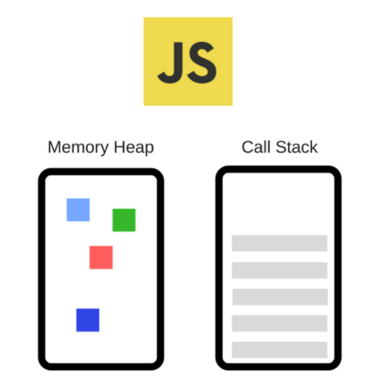

# javascript principle

## 개요

1. Javascript engine
2. V8
3. Runtime
4. Memory Heap and Call Stack

자바스크립트는 Front 에서 유일한 programming language 이기 때문에 반드시 사용할 줄 알아야한다.

또한 Backend에서 node.js 와 같은 자바스크립트 기반 언어 또한 많이 사용되기 때문에 Engine을 이해한다면, 보다 나은 설계와 개발을 할 수 있을 것이다.

## 1. Javascript Engine

