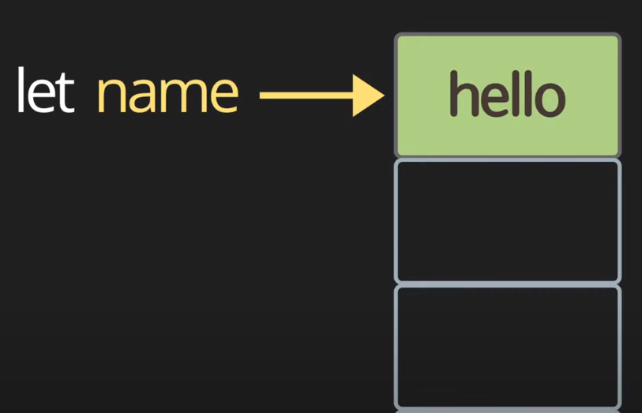
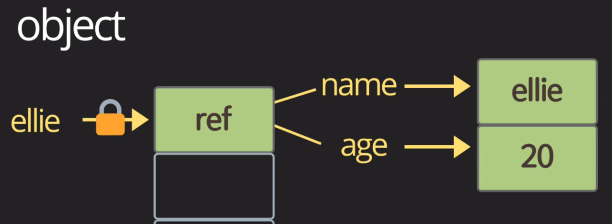

# Data Type

## Variable

### primitive type

변수를 선언하면, 메모리 어딘가에 변수에 선언할 숫자를 넣어두고, 이 숫자의 주소값을 가르키는 포인터를 변수에 가지고 있다. 그래서 변수에 할당되는 값을 바꿔나간다면, 우리는 변수의 주소값을 변경하게 된다.

### object type

- object를 가르키는 reference가 메모리에 저장된다. 
- reference : name과 age를 가르키는 주소를 가지고 있다. 
- name, age : ellie, 20이라는 데이터를 가르키는 주소다.