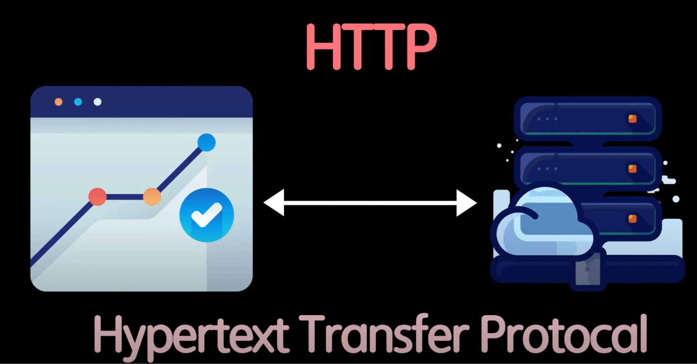
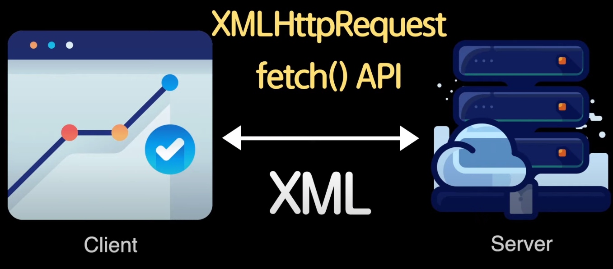
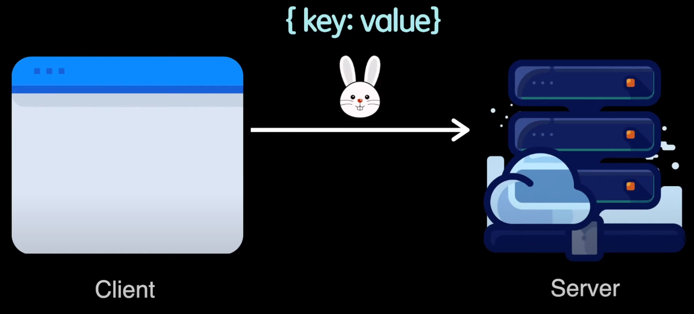
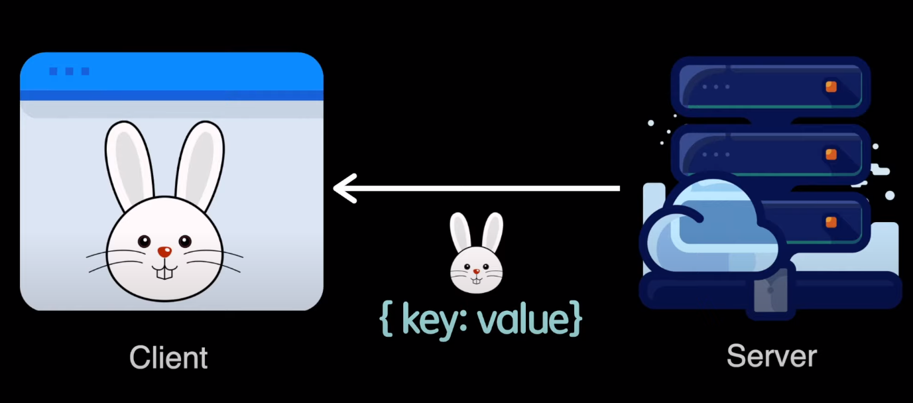

# JSON (JavaScript Object Notation)

## HTTP (HyperText Transfer Protocol)

브라우저 위에서 웹브라우저나 웹어플리케이션과 같은 클라이언트들이 어떻게 서버와 통신할까?를 정의한 것이 HTTP (HyperText Transfer Protocol)이다.

HTTP는 client는 server에 request, server는 response를 보낸다. 여기서 response는 데아터 모든 것을 말한다. data는  hypertext, image, 문서, resource, document 등등 여러가지가 존재한다.

 

## AJAX(Asynchronous Javascript And XML)

이러한 resource들을 받아오는 방법 중 하나인 AJAX가 있다.

AJAX는 웹페이지에서 동적으로 서버에게 데이터를 주고 받을 수 있는 기술을 말한다. 대표적으로 XHR (XML Http Request)가 있다. XHR은 브라우저 api에서 제공하는 object 중 하나로 이 object를 이용하면 서버에게 데이터를 요청하고 받아올 수 있다. 

최근 업데이트 된 fetch() API를 이용하면 간단하게 데이터를 주고 받을 수 있다. 하지만 신규라고 좋을 수는 없다. fetch는 IE에서 지원되지 않는다. XHR은 XML 뿐만 아니라, 여러 데이터들도 보낼 수 있다.

 

## JSON (JavaScript Object Notation)

Json 은 자바스크립트에서 주로 쓰이는 DataType이다. 

브라우저에서 서버와 통신할 때, XHR or fetch API를 쓰고, server는 XML를 보내기도 하고, JSON 파일을 보내기도 한다. 하지만 XML이 태그가 너무 불필요하게 많아서 Json file을 넘긴다.

자바스크립트에서 Object는 key:value 형식으로 이루어져있는데, json도 이와 동일하게 key:value 형식으로 이루어져있다.

## 특징 
1. 가장 간단한 data interchange format
2. text 기반 구조의 가벼운 format
3. 가독성이 좋다.
4. key : value
5. 프로그래밍 언어와 플랫폼에 상관없이 독립적이다.
6. 서버와 통신할 때, 직렬화(serialization) 할 때 쓰인다.

## json 사용 방식

실제로 우리는 그림처럼 json을 보내고, json으로 받는다.

## 기능

### 1. stringify

> object를 string으로 변환

- function이나 symbol은 변환되지 않는다.
- object는 parse할 때 변환 가능하다.
- callback 함수를 넣으면 세밀하게 통제 가능하다.
- 배열을 활용하여 원하는 요소만 추출 가능하다.

### 2. parse

> string을 object으로 변환

- object를 string으로 변환하고 string에서 parse를 통해 object를 변환하면 그안에 함수는 없어진다.
- object는 reviver을 활용하면 변환 가능하다.

## JSON 다룰 때 유용한 사이트

- JSON Diff checker: http://www.jsondiff.com/
- JSON Beautifier/editor: https://jsonbeautifier.org/
- JSON Parser: https://jsonparser.org/
- JSON Validator: https://tools.learningcontainer.com/json-validator/