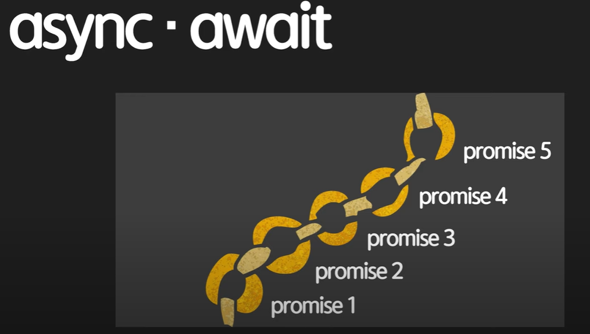

# Async & Await

## 왜 async & await 배울까? (Syntactic Sugar)



Promise는 비동기적인 활동이고, 이를 chain ring으로 묶어서 진행이 가능하다. 하지만 이렇게 하면 코드가 너무 난잡하게 된다.

    이 때, 이를 간결하게 만들어주는 API가 async, await이다.
    이러한 작업을 Syntactic Sugar이라 한다.

Promise 지옥 --> async await를 써서 해결할 수 있다.
그러나 무조건 promise를 안쓰고 async await를 써야하는건 아니다.

프로젝트 해보면서 감을 찾기를 바란다.

## async & await 문법

```javascript
    async function 함수명() {
    await 비동기_처리_메서드_명();
    }
```
주의!! _**비동기 처리 메서드가 꼭 프로미스 객체를 반환해야 await가 의도한 대로 동작한다.**_

## async await 정의

- async : Promise를 좀 더 간결하게 만들어주는 API다.
- await : async처리 method명을 적어주면, 그 method를 async대로 실행. delay가 끝날 때 까지, delay가 promise를 return할 때 까지 기다려줌.


chaining을 하는 것 보다는 동기적인 코드를 쓰는 것 처럼 보이게 한다.