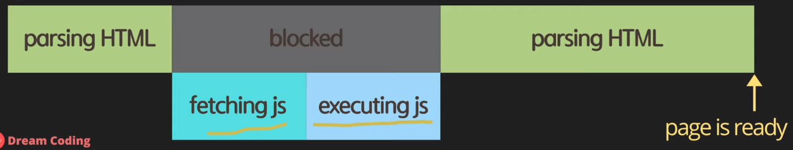
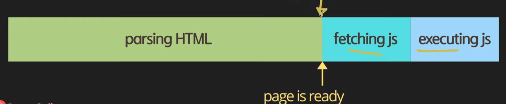
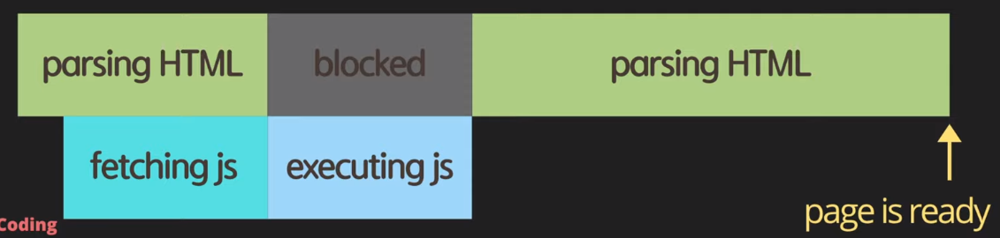
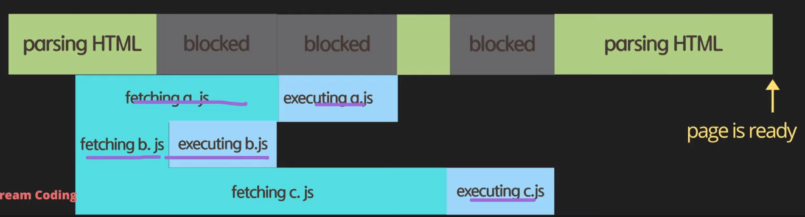
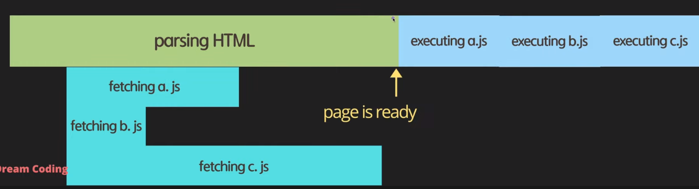

# Console, Async, Defer

## Console

- Web API는 자바스크립트안에 포함된 언어가 아니라 브라우저가 제공하는 브라우저가 이해할 수 있는 함수들이다.
- console은 언어안에 포함된건 아니지만, 통상적으로 많이 쓴다.
- console을 담당하는 api가 node.js 에도 있고, Web API에도 있다.
  - console.log 안에서는 간단한 자바스크립트를 실행가능하다. 디버깅도 가능하다. 

## Browser가 HTML 읽는 방법

### 1. head tag 안에

<code>

    <!DOCTYPE html>
    <html lang="en">
    <head>
        <meta charset="UTF-8">
        <meta name="viewport" content="width=device-width, initial-scale=1.0">
        <title>Document</title>
        
    </head>
    <body>
        

    </body>
    </html>

</code>

HTML을 parsing해서 읽는데 만약, Javscript file이 존재하면, 먼저 자바스크립트 파일부터 다운받고, 그 다음 HTML을 parsing 해서 읽어나간다.

_**단점**_ : js 파일이 너무 커서 다운 받는데 시간이 오래걸린다면, 브라우저에 웹페이지가 뜨는데까지 시간은 굉장히 오래걸릴 것이다.

### 2. body tag 안에

<code>

    <!DOCTYPE html>
    <html lang="en">
    <head>
        <meta charset="UTF-8">
        <meta name="viewport" content="width=device-width, initial-scale=1.0">
        <title>Document</title>
    </head>
    <body>
        

        
    </body>
    </html>

</code>

그래서 body 태그 안에 넣어, 제일 나중에 자바스크립트 파일을 다운받는다.

_**단점**_ : javascript에 의존하는 웹페이지 같은 경우는, 사용자가 제대로 된 웹페이지를 얻는데까지 시간이 오래걸린다는 단점이 존재한다.

### 3. head + async

<code>

    <!DOCTYPE html>
    <html lang="en">
    <head>
        <meta charset="UTF-8">
        <meta name="viewport" content="width=device-width, initial-scale=1.0">
        <title>Document</title>
        
    </head>
    <body>
        

    </body>
    </html>

</code>

이 부분은 head안에 async라는 속성 값을 주어, HTML을 파싱하는 동안 자바스크립트 파일을 동시에 병렬처리로 다운받도록 한다.

_**단점**_ : 만약, html tag 요소가 필요한 자바스크립트 파일이 있는 경우는, 제대로 읽어오지 못하여 웹페이지에 오류가 생길 수 있다. 그리고 html parsing 하는 동안에 언제든지 자바스크립트를 실행하기 위해 멈출 수 있어, 사용자가 사용하기 오래걸린다는 단점이 존재한다.

#### async가 여러 개일 때

<code>

    <!DOCTYPE html>
    <html lang="en">
    <head>
        <meta charset="UTF-8">
        <meta name="viewport" content="width=device-width, initial-scale=1.0">
        <title>Document</title>
        
        
        
    </head>
    <body>
        

    </body>
    </html>

</code>

위와 같이 자바스크립트 언어가 여러개있을 때, 가장 다운이 먼저 되는 자바스크립트 파일부터 실행한다.

_**단점**_ : 만약 자바스크립트 파일이 서로 순서가 있는 경우, 가령 a파일이 실행되고 b파일이 실행되야하는 경우는, 위의 사진과 같은 경우는 오류를 범할 수 있다.

### 4. head + defer

<code>

    <!DOCTYPE html>
    <html lang="en">
    <head>
        <meta charset="UTF-8">
        <meta name="viewport" content="width=device-width, initial-scale=1.0">
        <title>Document</title>
        
        
        
    </head>
    <body>
        

    </body>
    </html>

</code>

이 부분은 head안에 defer라는 속성 값을 주어, HTML을 파싱하는 동안 자바스크립트 파일을 동시에 병렬처리로 다운받도록 한다. 그리고 실행은 HTML 파일이 모두 다운받아지면, 그 때 실행한다.

페이지를 먼저 보여주고 자바스크립트를 실행한다는 옵션이 제일 효과적이다.

#### defer을 여러개일 때

우선 자바스크립트 파일을 다운받고, HTML이 모두 parsing이 끝나면, 그 이후에 a,b,c 파일을 하나씩 실행한다.

    defer을 쓰는 것이 제일 효율적이라고 말할 수 있다.