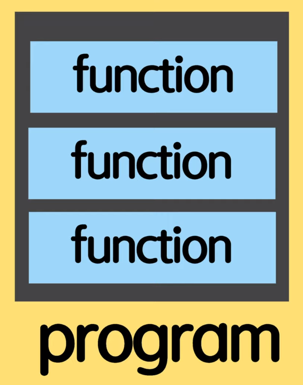

# function

자바스크립트는 function들의 과정을 적는 언어, procedure language라고 부른다.



통상적으로 프로그램은 function들의 집합체라고 말한다.

## 정의
 - 프로그램에서 기본적인 블럭형태
 - 서브프로그램으로써 여러번 동작이 가능하다. 모듈화
 - 일을 수행하거나 value를 계산한다.

## 특징
- function은 자바스크립트에서 object 이다.
- 따라서 함수가 변수로 할당이 되고, 파라미터로 넘겨지고, 험수를 return할 수 있다.

## Tip 정리!

### 1. Function Declaration Rule

```javascript

    function printHello() {
        console.log("Hello World!");
    }

    function log(message) {
        console.log(message);    
    }

```

- 기능 : 하나의 함수는 하나의 일만 하도록 한다.
- naming : doSomething, commnad 형태로 verb 형태로 정한다.
- specific : 함수 안에 두 가지 이상의 동작이 있다면, 이를 세분화해서 함수를 define 하자.
- e.g. createCardAndPoint -> createCard, createPoint

### 2. Early Return, Early Exit

```javascript

    // 7. Early Return, Early Exit
    // bad
    function upgradeUser(user) {
        if (user.point > 10) {
            // long upgrade logic
        }
    }
    // Good
    function upgradeUser(user) {
        if (user.point <= 10) {
            return;
        }
        // long upgrade logic
    }

```

- 일정 조건을 못 만족하면, 빨리 return 시키는게 가독성이 좋다.
- 일정 조건이 만족하는 것을 제일 뒤로 뺀다.

### 3. First-class Function

#### a. Function Expression

```javascript

    // First-class function

    // 1. Function Expression
    // function을 바로 변수에 선언이 가능하다.

    const print = function () { // anonymous function
        console.log("print");
    }
    const print = function name() { // named function
        console.log("print");
    }
    // function을 다른 변수에 재할당해서 사용가능.
    const printAgain = print;
    printAgain();
    const sumAgain = sum;
    console.log(sumAgain(1,3));

```

- function을 변수안에 할당이 가능하다.
- 변수를 선언하면서 함수를 정의해도 된다.
- 다른 변수에 함수를 재할당해서 사용도 가능하다.

#### b. CallBack Function

```javascript

    // 2. Function Expression을 써서 CallBack function 
    function randomQuiz(answer, printYes, printNo) {
        if (answer == 'love you') {
            printYes();
        }
        else{
            printNo();
        }
    }
    // anonymous function
    const printYes = function (){
        console.log('yes!');
    }
    // named function
    // 1. 나중에 디버깅할 때 함수의 이름이 보여서 자주 쓴다.
    // 2. 함수안에서 recursion 할 때
    const printNo = function print() {
        console.log('no!')
        // print()
    }
    randomQuiz('wrong', printYes, printNo);
    randomQuiz('love you', printYes, printNo);

```

- function을 실행할 때, function을 파라미터 인자로 받을 수 있다.
- anonymous function
- named function (_**개인적으로 함수명을 적는게 anonymous 보다 나은 것 같다...**_)
  - debugging 할 때, 함수의 이름을 볼 수 있다.
  - 함수안에서 재귀할 때 쓴다.

#### c. Arrow function

```javascript

    const simplePrint = () => console.log('simplePrint');
    const add = (a,b) => a+b;
    const Multiply = (a, b) => {
        return a*b;
    }

```

- 변수 이름 / (params) / return  할 value 순으로 작성

#### d. IIFE

```javascript

    (function hello() {
        console.log('IIFE');
    })();

```

- Immeadiately Invoked Function Expression
- 함수를 선언함과 동시에 출력하기를 바란다.