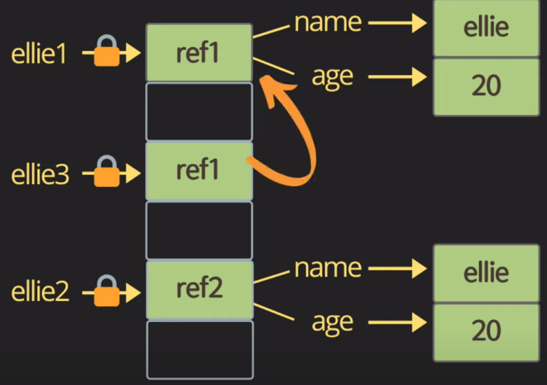

# object

사실 이 부분은 워낙 양도 방대하고 중요한 내용이기 때문에, [object.js](code/../../code/7_object.js) 파일을 보자.

## 정의
- Function, Data들의 집합 (Method, Fields)
- 자바스크립트에서는 data type 중 하나
- 자바스크립트에서는 Object = {key : value} 타입으로 이루어져있다.

## object를 왜 쓰는가?

1. 같은 type, 같은 속성끼리 묶어두면 가독성이 좋다.
2. 같은 성질로 분류하였기 때문에 관리하기도 편하다.
3. 

## 1. object equality by reference

<code>

    // object equality by reference
    const ellie1 = {name:'ellie'};
    const ellie2 = {name:'ellie'};
    const ellie3 = ellie1;
    console.log(ellie1 == ellie2); // false
    console.log(ellie1 === ellie2); // false
    console.log(ellie1 === ellie3); // true

</code>

ellie1과 ellie2는 내용은 같은 object이지만, 실제로는 서로 다른 reference, 서로 다른 주소를 가진 object이다. ellie3는 ellie1과 같은 reference를 가진다.

## 2. object 생성

<code>

    const ellie = new Object(); // first
    const ellie = {name : 'ellie', age : 4}; // second
    function print_another(person) {
        console.log(person.name);
        console.log(person.age);
    }
    print_another(ellie);

</code>

## 3. object Property 접근

### cf) 자바스크립트의 미친 짓

<code>

    //  미친짓 1 : object를 이미 생성하고 추가도 가능하긴함.
    ellie.hasJob = true;
    //  미친짓 2 : object를 이미 생성하고 추가도 가능하긴함.
    delete ellie.hasJob

</code>

> 이 부분은 진짜 별로다... class를 추가할 수도 있다는 말인데...흐음...해킹문제가 좀 걱정되긴 한다.

### property 접근

1. key를 써서 method나 data를 추가 가능하다.
2. [ ]
   - key는 string type으로 해야한다.
   - function에서 obj를 받아서 속성값을 다루고 싶을 때! 사용한다.
3. .
   - python과 비슷해 직관적이긴하다.
   - 사실 닷을 쓰는게 제일 좋다.

## 4. Property value shorthand

<code>

    //  1. 일일히 생성하기
    const person1 = {name:'bob', age:2}
    const person2 = {name:'harry', age:3}
    const person3 = {name:'paul', age:4}

    //  2. function 구현 후, 생성하기
    const person4 = makePerson('yoo', 100);
    function makePerson(name, age) {
        return{
            name,
            age,
        };
    }

    //  3. constructor 구현 후, 생성하기
    const person5 = new Person('yoo', 100);
    function Person(name, age) {
        // this = {};
        this.name = name;
        this.age = age;
        // return this;
    }

</code>

## 5. Operator

1. in
2. for..in
3. for..of

## 6. fun cloning

위의 그림을 빌려 얘기해보자면, ellie3는 ellie1의 ref1이 가르키는 name,age의 주소값들을 저장하고 있다.따라서 ellie3.name='something'으로 변형하고, ellie1.name을 출력하면 'something'으로 변형된다.

이러한 fun cloning을 방지하기 위해, 2 가지 방법이 존재한다.

1. old way
   1. user3 = {}; 생성한 후
   2. for..in 방법을 써서 자동 할당한다.
2. new way
   1. Object.assign