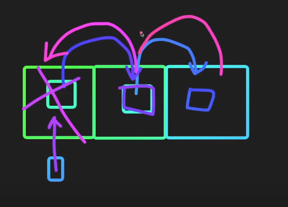

# Array

## Object vs Data Structure

- Object : 
  - 서로 연관된 것들을 묶어놓은 것들을 말한다. 
  - fields와 method들로 구성되어있다. 
  - method나 fields가 없는 경우도 있다.
- Data Structure :  
  - 원래는 자료구조안에는 동일한 type만 넣을 수 있다.
  - 비슷한 Object들을 묶어놓는 것을 말한다. 

이런 동일한 특성을 가지는 객체들을 어떻게 관리할 것인지를 여러 알고리즘으로 판단한다.

1. 어떤 삽입 알고리즘을 쓸 것인지, 어떤 삭제 알고리즘을 쓸 것인지, 어떤 검색 알고리즘을 쓸 것인지, 어떤 정렬 알고리즘을 쓸 것인지.
2. 어떤 문제를 해결하냐에 따라서 많은 자료구조 중에 어떤 자료구조를 선택해야할지, 그 자료구조에 맞는 알고리즘은 무엇인지 고민해야한다.

## Array

### **pop, push vs shift, unshift**

- pop, push : 데이터가 기존의 위치를 고수하면서 동작, 빠르다.
- shift, unshift : 
  - 기존의 데이터들을 한 칸씩 밀거나 당겨서 데이터를 재배열. 굉장히 느리다. 
  - 배열의 길이가 길면 길수록 더 느리다.

### 유용한 기능

1. join : 배열의 요소들을 string로 return. 이 때 operator를 입력 가능.
2. split : 규칙이 있는 string을 나눠서 array로 return
3. reverse : 배열의 순서를 바꿔서 array로 return
4. slice : 배열에서 원하는 부분만 array로 return
5. splice : 배열 자체를 수정하여 입력한 index 기준으로 그 부분을 제외한 나머지 array return
6. find : callback 함수가 돌면서, 해당 조건문을 만족하는 가장 첫 번째 요소 return.
7. filter : callback 함수가 배열을 지나면서 조건문을 만족하면 다 가져와서 array로 return.
8. map : 특정 함수를 거쳐서 변환된 value들을 array로 return.
9. some : 배열 중에서 callback 함수가 true가 되는 부분이 있다면 true return.
10. every : 배열에서 callback 함수가 모두 true가 된다면 true를 return.
11. reduce : callback 함수는 배열 모든 수에서 return. prev, curr가 파라미터이고, curr는 다음 사이클의 prev로 이어지면서 accumulate
12. sort : callback 함수의 return이 -면 앞에 값이 작다, +면 앞에 값이 크다. 정렬된 array로 return.