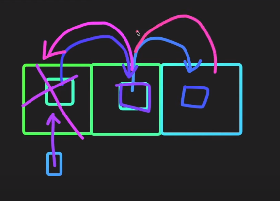

# Array

## Object vs Data Structure

- Object : 
  - 서로 연관된 것들을 묶어놓은 것들을 말한다. 
  - fields와 method들로 구성되어있다. 
  - method나 fields가 없는 경우도 있다.
- Data Structure :  
  - 원래는 자료구조안에는 동일한 type만 넣을 수 있다.
  - 비슷한 Object들을 묶어놓는 것을 말한다. 

이런 동일한 특성을 가지는 객체들을 어떻게 관리할 것인지를 여러 알고리즘으로 판단한다.

1. 어떤 삽입 알고리즘을 쓸 것인지, 어떤 삭제 알고리즘을 쓸 것인지, 어떤 검색 알고리즘을 쓸 것인지, 어떤 정렬 알고리즘을 쓸 것인지.
2. 어떤 문제를 해결하냐에 따라서 많은 자료구조 중에 어떤 자료구조를 선택해야할지, 그 자료구조에 맞는 알고리즘은 무엇인지 고민해야한다.

## Array

### **pop, push vs shift, unshift**

- pop, push : 데이터가 기존의 위치를 고수하면서 동작, 빠르다.
- shift, unshift : 
  - 기존의 데이터들을 한 칸씩 밀거나 당겨서 데이터를 재배열. 굉장히 느리다. 
  - 배열의 길이가 길면 길수록 더 느리다.

### function (number, index?)

<code>

    (method) Array<string>.splice(start: number, deleteCount?: number): string[] (+1 overload)

</code>

1. splice라는 method에서 ? 부분은 값을 넣어도 되고, 안 넣어도 되고의 의미이다.
2. T 라는 의미는 return을 의미한다.